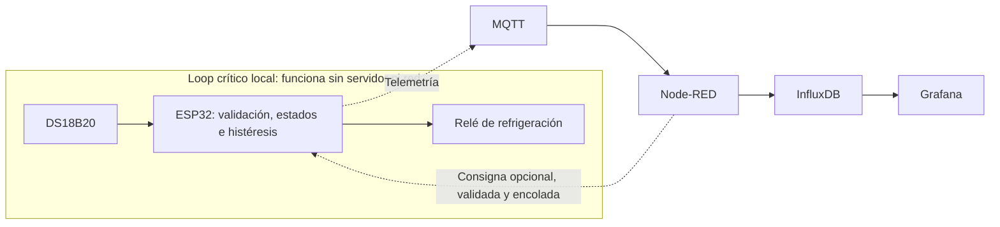

# Fermentador inteligente

Control de refrigeración para la fermentación de cerveza con ESP32, dos DS18B20 y relé. **Fase actual: baseline determinista.** Primero se valida el controlador local y el montaje físico. No hay control adaptativo, ML, predicciones ni decisiones automáticas de fermentación.

## Control local e independiente



El ESP32 decide el encendido y apagado. La tarea de control no llama a Wi-Fi, MQTT, display, Serial ni almacenamiento. La red está en otra tarea/núcleo y entrega comandos mediante una cola acotada. Una conexión TCP bloqueada no bloquea la tarea de control. Node-RED administra consignas; no autoriza encendidos ni forma parte de la protección del compresor.

## Implementado

- Control local por histéresis, configurable entre 0,05 y 2 °C; valor inicial 0,3 °C.
- Consigna inicial 18 °C, validación estricta `0 < SP < 30`, valores deseado y aplicado separados. Un mensaje inválido conserva la consigna aplicada.
- Estados explícitos: `BOOT_HOLD`, `IDLE`, `COOLING`, `COMPRESSOR_LOCKOUT`, `SENSOR_FAULT`, `MAINTENANCE`.
- Cinco minutos OFF después de cada boot y entre apagado y siguiente encendido. No se recupera un supuesto estado anterior del compresor.
- Validación independiente de MOSTO y AMBIENTE: tres lecturas consecutivas válidas, desconexión/CRC, -127, 85, NaN, rangos y antigüedad.
- Falla de MOSTO: OFF. Falla solo de AMBIENTE: continuar control con `degraded=true`.
- Salida ACTIVE LOW encapsulada y modo DRY_RUN que nunca ordena LOW al GPIO 26.
- Telemetría explicativa y logs por eventos. Persistencia de consigna/histéresis válidas en NVS, separada entre DRY_RUN y HARDWARE.
- Watchdog de tarea de control; un plazo de control perdido fuerza OFF y deja un error interno hasta reiniciar.

Estas funciones están implementadas y probadas en software. El 7 de octubre de 2026 se realizaron pruebas de banco con sondas y relé sin compresor: corte por temperatura, bloqueo entre ciclos, pérdida/recuperación de sensores, mantenimiento, reinicio con cinco minutos OFF y pérdida/restauración de Wi-Fi y MQTT conservando el control local. Ver [resultados](docs/VALIDATION_RESULTS.md), [evidencia física](docs/PHYSICAL_VALIDATION.md) y [telemetría recibida](docs/evidence/mqtt-maintenance-2026-10-07.json).

**La aceptación completa sigue pendiente:** no se ensayó refrigeración real. El nivel OFF antes de ejecutar el firmware depende también del montaje; falta confirmar polarización externa y caracterizar transitorios breves antes de conectar un compresor. También permanece pendiente el diagnóstico de corrupción Serial intermitente observada en las capturas. Los límites y las fases restantes están en [HARDWARE_VALIDATION.md](docs/HARDWARE_VALIDATION.md).

## No implementado todavía

Control adaptativo, machine learning, predicciones, decisiones automáticas de fermentación, calefacción, detección de diacetilo y automatización de perfiles completos. La biblioteca anterior de recetas/densidad permanece sin conectarse al controlador. El [diseño adaptativo](docs/control-adaptativo.md) es una referencia futura, fuera de esta etapa.

## Hardware y conexión

| Función | Pin ESP32 |
|---|---|
| DATA de ambos DS18B20 | GPIO 4 |
| Relé ACTIVE LOW, entrada compatible con 3,3 V | GPIO 26 |
| TM1637 CLK / DIO | GPIO 18 / 19 |

Cada DS18B20 usa alimentación de tres hilos: VDD a 3,3 V, GND común y DATA a GPIO 4. Ambos comparten el bus. Resistencia de 4,7 kΩ entre DATA y 3,3 V. No se admite alimentación parasitaria en esta versión. No asumir colores de sondas ni orientación de encapsulados.

El módulo de relé debe estar identificado antes de decidir su alimentación. No conectar una bobina directamente al GPIO ni un IN que eleve el GPIO a 5 V. Mantener el compresor desconectado en las fases A–C. Ver [conexión y validación](docs/HARDWARE_VALIDATION.md).

Las ROM existentes de MOSTO y AMBIENTE están en `include/hardware_config.h`. El comando Serial `ROM` muestra los dispositivos reales y entra en MAINTENANCE con salida OFF. Identificar cada sonda físicamente, corregir solo ese mapeo y recompilar; nunca elegir roles por índice del bus.

## Compilar y cargar

```sh
cp secrets.ini.example secrets.ini
# Completar datos privados si se quiere telemetría; sin red sigue el control local.
pio run -e esp32-dry-run
pio run -e esp32doit-devkit-v1
```

Plataforma fijada: espressif32 7.0.0 / Arduino ESP32. `secrets.ini` no se publica. `pio run` sin entorno elige DRY_RUN.

| Entorno | GPIO 26 | Consignas MQTT | OTA |
|---|---|---|---|
| `esp32-dry-run` (por defecto) | Siempre HIGH | Deshabilitadas | Deshabilitada |
| `esp32doit-devkit-v1` (HARDWARE) | Según control local | Deshabilitadas | Deshabilitada |
| `esp32-mqtt-test` | Siempre HIGH | Habilitadas | Deshabilitada |
| `esp32-ota-test` | Siempre HIGH | Deshabilitadas | Habilitada para comprobación opcional |

Se conserva el nombre del entorno histórico HARDWARE. El bloqueo de consignas remotas es deliberado durante la validación: un mensaje retenido o perfil viejo no debe dirigir estas pruebas. Los mensajes malformados/fuera de rango se rechazan incluso en ese modo. Para pruebas remotas usar el entorno dedicado y un broker controlado. No activar perfiles completos.

Con compresor desconectado y puerto identificado:

```sh
pio run -e esp32-dry-run -t upload --upload-port /dev/ttyUSB0
pio device monitor --port /dev/ttyUSB0 --baud 115200
```

El puerto es un ejemplo: verificarlo. Cerrar otros monitores antes de cargar. La carga cambia el firmware de la placa. OTA es opcional y queda deshabilitada en la baseline; si se activa, exige contraseña privada y confirmación local de OFF antes de escribir flash. Una falla OTA deja mantenimiento latched hasta reiniciar.

## Comandos Serial

Enviar una línea a 115200 baudios:

| Comando | Resultado |
|---|---|
| `STATUS` | Estado, temperaturas, validez, consigna, salida y espera restante |
| `SP 18` | Solicitar una consigna validada |
| `HYST 0.3` | Configurar histéresis |
| `MAINT ON` / `MAINT OFF` | Entrar/salir de mantenimiento; la protección sigue vigente |
| `ROM` | Escanear ROM; deja mantenimiento activado y salida OFF |
| `SIM MOSTO 25` / `SIM AMBIENTE 22` | Simular lecturas solo en DRY_RUN |
| `SIM MOSTO OFF` / `SIM AMBIENTE OFF` | Simular falla solo en DRY_RUN |
| `SIM CLEAR` | Volver a sensores físicos, solo en DRY_RUN |

Las simulaciones atraviesan la validación y la protección reales: no acortan los cinco minutos. En DRY_RUN `cooling_active` indica una orden simulada y `relay=false` la salida física apagada. El modo nunca se cambia por Serial ni MQTT: requiere otro firmware.

## MQTT y telemetría

Se conservan `birra/telemetria` y `birra/setpoint`. Una consigna es un número completo, finito y en rango: `18basura`, NUL, NaN, infinito y valores fuera de rango se rechazan. Al perder MQTT se conserva la consigna aplicada y continúa el control local.

Ejemplo simulado y abreviado:

```json
{
  "mosto": 18.4, "ambiente": 22.1,
  "mosto_valid": true, "ambiente_valid": true,
  "setpoint_desired": 18.0, "setpoint_applied": 18.0,
  "controller_state": "COOLING", "cooling_request": true,
  "cooling_active": true, "relay": false,
  "lockout_remaining_s": 0, "wifi": false, "mqtt": false,
  "degraded": false, "fault": null, "uptime_s": 12345,
  "message_seq": 7, "control_cycles": 617250, "dry_run": true
}
```

MQTT publica cada diez segundos mientras está conectado; `STATUS` permite observar sin red. Temperaturas inválidas se representan como `null`. Se conservan los alias `rele` y `setpoint`; los consumidores deben revisar validez antes de almacenar/usar temperatura. También se incluyen causas de falla de sensor, rechazos, pérdidas de conexión, eventos descartados y mayor intervalo entre ciclos. El 10 de octubre de 2026 se verificó la recepción, escritura y lectura de estos campos en InfluxDB y su visualización en Grafana con el ESP32 en banco. La refrigeración real sigue pendiente (FASE D).

Uptime se acumula con tiempo monotónico y no necesita NTP. El contador de mensajes es por boot; QoS 0 no garantiza entrega y no se reenvía el historial offline. Tras recuperar conexión se publican estado actual y contadores de pérdidas.

## Pruebas y aceptación

```sh
scripts/test_host.sh
```

Requiere un compilador C++ (`CXX` configurable) y Python 3. Incluye los casos A–J y recuperación, mantenimiento, overflow de tiempo, parser estricto, salida ACTIVE LOW, DRY_RUN y JSON. Conserva las pruebas del guard y de recetas existentes. Compilar no equivale a validar sensores, contacto del relé, polarización durante boot ni refrigeración real.

Ver [arquitectura y transiciones](docs/BASELINE_DESIGN.md) y [pruebas físicas](docs/HARDWARE_VALIDATION.md). Esta etapa no se declara terminada hasta completar y registrar sus criterios físicos.


## Supervisión: Node-RED y Grafana

La [mejora de Node-RED](server/nodered/README.md) valida la telemetría, corrige la lectura y escritura del progreso persistente, distingue consigna calculada/aplicada y detecta ausencia de mensajes desde el arranque. Fue desplegada y verificada con 48 nodos activos; sus funciones también pasan 20 pruebas aisladas en Node.js 16 y 24. La publicación de consignas MQTT, Telegram y el inicio de lote permanecen bloqueados en esta etapa.

El [dashboard de Grafana](server/grafana/README.md) muestra temperaturas, consigna aplicada, desvío, estado del controlador, vigencia, sensores y diagnóstico. El perfil de prueba se presenta por separado. Corrige el aprovisionamiento incompatible y el cálculo de progreso desde la primera medición histórica. El archivo JSON y las consultas Flux son reproducibles y no contienen credenciales.

Se verificaron la integración real MQTT → Node-RED → InfluxDB → Grafana, 30 consultas de lectura y los paneles en navegador. Los datos corresponden a un ensayo de banco sin compresor; **FASE D pendiente**. Ver [respaldo, despliegue y límites de validación](docs/SERVER_DEPLOYMENT.md).
