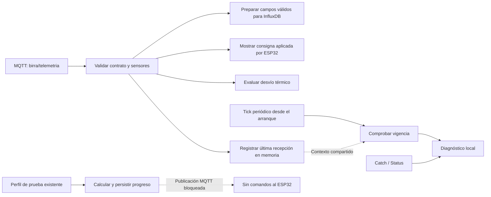

# Node-RED: primera mejora de supervisión

Primera mejora **desplegada y verificada en edge-01 el 10 de octubre de 2026**, a partir de los flujos activos. No cambia firmware ni agrega ML, predicciones o decisiones automáticas de fermentación. El lazo DS18B20 → ESP32 → relé continúa independiente del servidor.

La primera entrega organiza la pestaña del fermentador en cuatro grupos y corrige errores reproducibles. Conserva el flujo Clima y las configuraciones compartidas de MQTT, InfluxDB, Telegram y Dashboard.



## Cambios concretos

| Área | Antes | Cambio desplegado |
|---|---|---|
| Telemetría | Distribución directa a almacenamiento, alarma y watchdog | Validación común antes de distribuir |
| Lecturas inválidas | Se aceptaban números como −127; no se consultaban flags | Se conserva el evento y su validez, omitiendo la temperatura inválida en Influx |
| Consignas | La UI llamaba «activa» a la calculada del perfil | Widgets separados para calculada y aplicada, esta última tomada de telemetría |
| Progreso | Escritura en `file`, lectura en memoria | Objeto `estado_lote` leído y escrito en `file` |
| Cambio de consigna | Retorno anterior a guardar los tiempos | Guarda el estado antes de retornar; no confunde cálculo con aplicación |
| Inicio de lote | Pulsar otra vez reemplazaba fecha y receta | Rechaza un segundo inicio; botón de editor bloqueado en esta etapa |
| Vigencia | El trigger necesitaba un primer mensaje | Tick cada 30 s, también sin mensajes después del arranque |
| Diagnóstico | Sin Catch ni Status | Errores, estados de conexión y transiciones de vigencia en Debug |
| Nombres | «Orquestador PID», «UI: Btn» sobre un Inject | «Perfil interpolado» e «Inject»; grupos numerados por función |

La función de telemetría acepta objeto, JSON o Buffer. Una consigna aplicada inválida, un booleano mal formado o un mensaje retenido sin fecha verificable no refrescan la vigencia. Una temperatura inválida sí produce un registro de diagnóstico; la comunicación puede estar presente aunque MOSTO falle. Se conservan los alias `setpoint` numérico y `rele` numérico 0/1. No se convierte `null` a 0 °C.

El objeto persistente `estado_lote` contiene la consigna **calculada**, progreso y fecha de cálculo. No demuestra aplicación de una consigna. No se crean días transcurridos/restantes artificialmente en cero si todavía no hay estado calculado.

## Valores y bloqueos para la primera etapa

- `TELEMETRIA_TIMEOUT_S`: 900 segundos por defecto. Verificación cada 30 segundos. Los eventos se emiten solo al cambiar entre vigente y ausente, a Debug.
- `THERMAL_ALERT_DELTA_C`: 20 °C por defecto, conservando el valor de prueba existente. Debe definirse un umbral operativo y duración mínima antes de activar avisos para un lote real. Esta entrega no recomienda 20 °C como umbral cervecero.
- El nodo de salida MQTT de consignas queda deshabilitado (`d=true`). El perfil existente se calcula para supervisión; no se automatizan sus consignas.
- El emisor de Telegram queda deshabilitado durante validación. Los nuevos diagnósticos no envían mensajes externos.
- El antiguo trigger de vigencia queda deshabilitado y se sustituye por la comprobación periódica.
- El Inject de inicio de lote queda deshabilitado. La receta de 3 °C se identifica expresamente como dato de prueba, no como receta recomendada.

Estos bloqueos se aplicaron con autorización expresa y permanecen activos durante esta etapa de validación. El mensaje MQTT retenido que ya exista en el broker no se borra ni se modifica. Antes de una futura habilitación de consignas habrá que verificar explícitamente ese mensaje y la configuración del dispositivo.

## Artefactos y pruebas

`functions/` contiene los cuerpos exactos de los Function Nodes. `build_patch.py` genera:

- `patch.json`: cambios por ID y nodos nuevos; no reemplaza configuraciones ni credenciales. Incluye el hash de la base inspeccionada.
- `flows.review.disabled.json`: vista saneada para revisar en un editor aislado, con todas las pestañas y salidas externas deshabilitadas. **No usar para reemplazar los flujos de producción**: tiene placeholders de servicios y no incluye credenciales.

La carpeta `reference/` contiene la base saneada y el inventario usados en las pruebas, el parche por ID y la vista deshabilitada. La base histórica es una fixture de tests: **no importarla al runtime**. Ninguna exportación saneada reemplaza producción.

Ejemplo reproducible desde la raíz del repositorio:

```bash
python3 server/nodered/build_patch.py server/nodered/reference/base.sanitized.json server/nodered/reference/base.inventory.json /tmp/nodered-candidate
node server/nodered/test_functions.cjs server/nodered/reference/base.sanitized.json /tmp/nodered-candidate/patch.json /tmp/nodered-candidate/flows.review.disabled.json
```

Se aprobaron 20 casos con Node.js 24.19.0 local y con Node.js 16.20.2 instalado en el servidor. La segunda ejecución usa VM y contexto simulado, sin conexiones MQTT, escritura en bases o modificación del Node-RED activo. Reproduce los errores del flujo anterior, prueba fallas de sensor, parsing, progreso, perfiles inválidos, inicio repetido, timeout desde arranque, recuperación y conservación de conexiones/configuraciones.

Los tests aislados validan funciones y estructura del grafo. En el despliegue se comprobaron además los 48 nodos activos, recepción real del ESP32 de banco, escritura y lectura posterior en InfluxDB, contexto persistido y Dashboard: consigna calculada 3 °C frente a aplicada 18 °C. Ambas sondas eran válidas y las secuencias/ciclos avanzaban. No se repitieron maniobras físicas de falla; la refrigeración real sigue pendiente (FASE D).

## Despliegue realizado

Se respaldó el directorio activo completo en una ubicación privada de edge-01. Se verificaron integridad y archivos críticos, incluido el material cifrado y su configuración de recuperación. El respaldo no está en Git. Node-RED se pausó 15,05 segundos durante la copia y después se reanudó; no se reiniciaron contenedores.

Se comprobó hash/revisión de la base y se aplicaron los cambios por ID mediante la API v2 con revisión concurrente. Runtime y disco coinciden, las credenciales no cambiaron y se conservaron Clima y configuraciones compartidas. No se reemplazó producción con la vista saneada.

La verificación encontró Node-RED saludable y datos reales de banco posteriores al despliegue en InfluxDB, incluidos `setpoint_applied`, flags de validez y progreso leído del store `file`. El Dashboard muestra consignas calculada/aplicada separadas. MQTT, InfluxDB y Grafana permanecieron activos. No se publicaron comandos de prueba ni se habilitaron OTA o consignas remotas.

El parche generado conserva el hash de su base original: **no volver a aplicarlo ciegamente ni usarlo como exportación completa**. Un despliegue futuro requiere leer y revisar el estado actual. La recuperación de flujos y el respaldo completo quedaron documentados en el informe local de despliegue; no fue necesario revertir y no se ensayó una restauración completa.

## Siguientes entregas

Autenticación del editor, actualización compatible de Node-RED/Node.js en un entorno de prueba, catálogo versionado de recetas y lotes, captura manual de densidad, identificación de datos de banco y lotes reales, confirmación de consignas, políticas de alarma y respaldo/restauración. Grafana se ajustará al contrato de telemetría después de verificar su almacenamiento. La biblioteca de recetas Python existente aún no está conectada a Node-RED. Ver [registro de despliegue](../../docs/SERVER_DEPLOYMENT.md) y [Grafana](../grafana/README.md).

Referencias: [contexto y stores de Node-RED](https://nodered.org/docs/user-guide/context), [Function Nodes, errores y múltiples salidas](https://nodered.org/docs/user-guide/writing-functions), [formato de escritura del complemento InfluxDB](https://github.com/mblackstock/node-red-contrib-influxdb), [seguridad del editor](https://nodered.org/docs/user-guide/runtime/securing-node-red).
