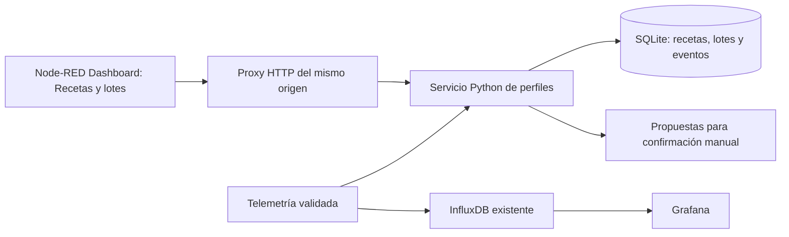

# Recetas y lotes por etapas

Gestor supervisado integrado con Node-RED Dashboard. Conserva recetas versionadas, lotes, densidades manuales y decisiones en SQLite. **No publica MQTT ni controla el relé.** Las consignas remotas permanecen bloqueadas y la refrigeración real sigue pendiente: FASE D.

## Uso

En el menú del Dashboard de Node-RED, abrir **Recetas y lotes** (`/dashboard/perfiles`). También existe una vista directa en `/perfiles` del mismo servidor Node-RED.

1. **Recetas:** crear una receta con nombre, levadura, estilo y FG estimada opcional. Agregar etapas en el orden deseado. Cada etapa tiene objetivo, rampa máxima en °C/h, duración mínima, máxima orientativa opcional y criterio de salida. Guardar genera una versión; duplicar abre una nueva receta; archivar conserva las versiones y los lotes existentes.
2. **Lote activo:** seleccionar una receta y una versión concreta; cargar OG corregida, temperatura inicial real, volumen y clasificación banco/real. Esta instalación admite un lote activo o pausado para `fermentador-1`. Iniciar registra la planificación, sin enviar consignas al ESP32.
3. **Cargar medición:** ingresar SG corregida, fecha/hora real de medición, instrumento, temperatura de muestra y observaciones. El navegador convierte la hora local a una fecha con zona horaria. No se convierte una lectura cruda de refractómetro. Una carga tardía conserva tanto la fecha medida como la de registro.
4. **Historial:** consultar mediciones y decisiones, anular una lectura con motivo y exportar el lote completo como JSON. No se borran lecturas ni eventos. La pantalla muestra los últimos 200 eventos; la exportación contiene todos.

Editar una receta nunca cambia la copia del lote. Los cambios de etapa, cierres, pausas y cancelaciones incrementan su revisión. Un segundo navegador con estado antiguo recibe un conflicto y debe recargar. Las operaciones también tienen identificador idempotente: repetir exactamente una petición confirmada no la ejecuta dos veces.

## Perfil y criterios

La primera rampa parte de la temperatura inicial ingresada. Las siguientes parten de la última consigna propuesta al confirmar la transición. El cálculo limita el movimiento a la rampa configurada y se detiene en el objetivo. Pausar congela el tiempo y la consigna propuesta; reanudar continúa desde allí. **Pausar un perfil no ejecuta `MAINT ON` ni apaga el relé.**

El motor propone avanzar únicamente cuando se cumple la duración mínima y el criterio seleccionado:

- **Manual / duración mínima:** permite la confirmación humana cuando transcurrió el mínimo. No ejecuta transiciones por reloj.
- **Atenuación:** exige densidad vigente y porcentaje aparente igual o superior al configurado.
- **Estabilidad:** exige lecturas con timestamps distintos, cobertura temporal y tolerancia configurada, además de vigencia. Tres lecturas tomadas juntas no demuestran estabilidad durante 48 horas.

Todo ingreso a una etapa de enfriado exige además densidad vigente y estable y comprobación manual de diacetilo aprobada. Una nueva densidad o una anulación deja esa comprobación pendiente para revisar la decisión. No se permite iniciar directamente en enfriado. Superar la duración máxima orientativa solo muestra una advertencia; nunca cambia de etapa ni finaliza el lote.

Los valores iniciales de vigencia (24 h), ventana (48 h) y tolerancia (0,001 SG) son parámetros editables de la aplicación, no una recomendación universal para una levadura o estilo. La atenuación no mide directamente azúcares residuales ni diacetilo.

Se muestran por separado:

- Consigna **propuesta**, calculada por el gestor, sin envío al equipo.
- Consigna **aplicada**, recibida de la telemetría validada del ESP32.
- Horas de la etapa, atenuación aparente y avance hacia una FG estimada. Este último puede superar 100 %; no certifica finalización.

La telemetría del gestor se mantiene en memoria y vence a los 900 s; tras reiniciar el servicio necesita una recepción nueva. Los datos originales siguen entrando a InfluxDB por la rama existente. El gestor no inserta densidades ficticias ni perfiles como temperaturas medidas en InfluxDB. Grafana continúa mostrando la supervisión física y el perfil anterior claramente identificado como prueba; no se reemplaza ese histórico con un lote nuevo.

## Persistencia y arquitectura

`server/fermentation.py` conserva la biblioteca anterior y acepta también recetas `staged-v1`. `ProfileStore` agrega catálogo, lotes, mediciones, eventos e identificadores de operaciones. Las mutaciones usan transacciones SQLite, WAL y `synchronous=FULL`; el contexto de Node-RED no es el registro principal del lote.



El servicio Python usa solo biblioteca estándar. Corre con UID/GID 1000, sin capacidades, raíz de contenedor de solo lectura y un volumen de datos escribible. Comparte la red interna de Node-RED y **no publica un puerto en el host**. El proxy permite rutas fijas; las escrituras desde navegador requieren JSON, cabecera propia y Origin coincidente. No se habilita CORS.

Esas barreras evitan peticiones de formularios ajenos, pero **no autentican al operador**. El acceso hereda el perímetro actual de Node-RED: utilizar solo desde la red de confianza/VPN, sin exponer el servicio a Internet. La autenticación del editor y de usuarios de aplicación continúa como mejora pendiente.

El parche agrega una pestaña, página y nodos propios; del flujo existente solo amplía la salida de `nr10_validar`. Conserva Clima, credenciales, ajustes del usuario y los cuatro nodos bloqueados. El perfil antiguo y su contexto se conservan; no se importan como receta real ni se sobrescriben.

## Pruebas reproducibles

Desde la raíz del repositorio:

```bash
python3 -m unittest server.profiles.test_store test.test_fermentation -v
node server/profiles/test_proxy.cjs
```

Los tests usan SQLite temporal y reloj controlado. Incluyen versiones inmutables, rampa desde temperatura inicial, pausa, reinicio, conflictos, idempotencia, anulación sin pérdida de historial, datos vencidos, retroceso del reloj y bloqueo de enfriado. El test del proxy ejecuta el cuerpo exacto del Function Node y comprueba el grafo y los rechazos CSRF. No acceden a MQTT, bases reales ni al relé.

## Instalación y actualizaciones

`manage.py` se ejecuta desde una máquina con SSH autorizado y Python 3. El servidor requiere Docker Compose, la red interna compartida, UID 1000 y una imagen Python ya verificada. La entrega inicial reutiliza la imagen Python local, fijada por ID; no descarga imágenes ni modifica el agente anterior.

```bash
python3 server/profiles/manage.py inspect --host usuario@servidor --identity /ruta/clave --state-dir /ruta/estado
python3 server/profiles/manage.py backup --host usuario@servidor --identity /ruta/clave --state-dir /ruta/estado
python3 server/profiles/manage.py install --host usuario@servidor --identity /ruta/clave --state-dir /ruta/estado
python3 server/profiles/manage.py verify --host usuario@servidor --identity /ruta/clave --state-dir /ruta/estado
```

La inspección y el respaldo deben ser recientes. La instalación inicial rechaza una carpeta existente, cambios concurrentes de flujos y conflictos de IDs. Node-RED se despliega por API v2 con revisión y modalidad `flows`; no se reinicia el contenedor. Se comprueban los bloqueos, credenciales, runtime/disco y contenedores originales. El servicio nuevo ejecuta tests en `/tmp`, separados del SQLite activo, antes de habilitar la página.

Para actualizar **solo el servicio y sus archivos**, repetir `inspect`, `backup`, `update`, `verify`. `update` compara los hashes del despliegue anterior y no sobrescribe código remoto editado. Una modificación del parche de Node-RED requiere su propia revisión y despliegue; `update` no cambia el grafo instalado.

Para cambiar únicamente la interfaz HTML, `assets` comprueba los hashes, respalda el HTML anterior y una copia consistente del SQLite, y reemplaza el archivo atómicamente. No reinicia servicios ni pausa Node-RED. La página lee el HTML actualizado en la siguiente carga.

## Respaldo y recuperación

El comando `backup` guarda el directorio completo de Node-RED, su runtime original y hashes de archivos críticos en una carpeta privada del servidor. Pausa brevemente Node-RED para copiar y lo reanuda en `finally`. Cuando el gestor existe, guarda también código, Compose, configuración de imagen/red y una copia **consistente mediante la API SQLite backup**, con comprobación de integridad. No copiar solo el archivo SQLite vivo ignorando WAL.

Los respaldos quedan bajo `$HOME/.local/state/fermentador/backups/`, con acceso privado. No se publican en GitHub. No contienen el estado volátil en RAM de Node-RED ni la última telemetría en memoria del gestor.

`snapshot` guarda solo el gestor completo (código, Compose, imagen/red y SQLite consistente), más una copia del grafo actual de Node-RED, sin pausar servicios. Es útil después de registrar mediciones; no sustituye el respaldo completo de Node-RED con sus credenciales y configuración de recuperación.

`rollback` sirve para revertir el **parche inicial de flujos**, siempre que todavía coincida con su candidato: usar el directorio de estado que conserva el backup anterior a `install`. Conserva el servicio y los datos del gestor para recuperación. No usarlo con el estado de un backup posterior a una actualización.

Una recuperación del servicio debe preservar primero los datos actuales, detener solo `perfiles`, restaurar código/configuración y el SQLite consistente del respaldo elegido, comprobar integridad, reiniciar y verificar por la interfaz. No restaurar mientras escribe ni reemplazar sin revisión mediciones posteriores al respaldo. La entrega verifica copias e integridad y recuperación de estado tras reiniciar; no afirma una restauración completa de toda la infraestructura.

Ver [registro de despliegue](../../docs/PROFILES_DEPLOYMENT.md).

Referencias: [API de despliegue Node-RED](https://nodered.org/docs/api/admin/methods/post/flows/), [ui-template de Dashboard](https://dashboard.flowfuse.com/nodes/widgets/ui-template.html), [contexto persistente de Node-RED](https://nodered.org/docs/api/context/store/localfilesystem).
